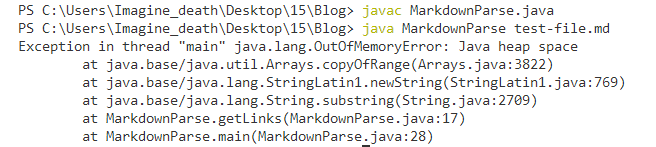
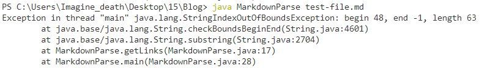
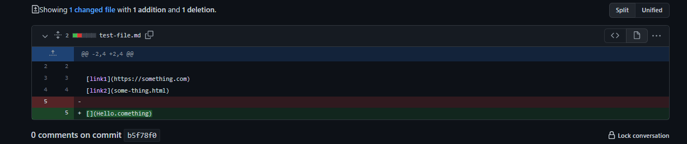
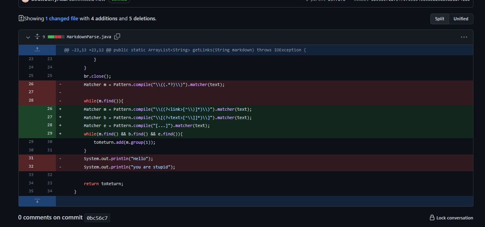

# Lab 2 Report: Troubleshooting Code Collaboratively 

## Introducation

 Bug, a word that represent inssants, but in computer programming, this word represent errors. Bugs are everywhere just like insants are everywhere. There is no way to avoid bugs, not even the best programmer in the world will avoid it. Some bugs are easy to find, but some don't. Best way to fix those unseen bugs is work with your friends or ask others that have more experience than you.

Let's take a look at an example.

This is the starter code that was given for the my lab

and the starter test for this cod

This program is basically storing the link address that markdown renders in the arraylist and return the valid address(s) that store in the arraylist, but notice how the test is perfect and the format is also the markdown renders format. Can this conclude that the program is perfect? Obviously no, there are other tests that will break the program easily.

## Test-Case 1

Notice the picture below how the there is an empty of at the end of this markdown file, when you run it the program, it will run into an infinity loop.

The error message will be like this.

[Failed Test Case 1](https://github.com/StrawberryAkai/lab3/commit/80611a5529a590b25871f65099735b0c908a5d59)

## Symptom 1

The symptom in here is java heap space, this symptom is basically the test case is causing a infinite loop that creates a lot of memories that the computer can't handle.

## Resolve 1

My way to solve this is pretty simple but involved changing the whole thing (see picture below). Instead of reading the markdown file at the main, I read it in the method by using buffer reader to read the file and store it into the `String` class `text`.

Then after this there is a two ways to do it, loop the text, find the index of `(` and `)` and substring it. Second one is using regular expression, so called regex. it is basically a simple version of looping the string, find the index of the `(` and `)`, substring it and add it to the arraylist. In this case, I used regular expression to help me solve this.

## Test Case 2

My new program also fixed other test that will cause the problem with missing one of the parentheses, which is good, because the original one will output an error message and we don't want this to happen to our new code as well.

[FailedTest2](https://github.com/StrawberryAkai/lab3/commit/895d73a7b0b1bc0fc3426407e6309df7e159f94c?diff=unified)

## Sympthm 2

The Sympthm here is starting from index 48, which is the index of `(`, end -1, which `)` does not exist, so it means that when the either parentheses are not in test case, it will output this error message.

## Solution 2

The code that solve this test case is in the picture below, this is basically looking for any code in between the parenthese, if there is a missing parenthese, it won't add the website in there.

## Test Case 3

The last test case that will break the code is when you have nothing inside of the brackets.

[Fail Test 3](https://github.com/StrawberryAkai/lab3/commit/b5f78f050a237886f64139dc6ddd39b7fc24c4d4)

## Sympthm 3

This is actually not a bug at all because of the fact that this test case has everything that required, which is ``, so there is no error message when you run the test in terminal. However markdown doesn't render it as a website when there is nothing in between the brackets.

## Solution 3

So the solution for this is pretty simple, I just need to check if there is anything in between the brackets.

