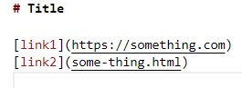

<h1>
     Lab 2 Report: Troubleshooting Code Collaboratively 
</h1>

## Introducation

 Bug, a word that represent inssants, but in computer programming, this word represent errors. Bugs are everywhere just like insants are everywhere. There is no way to avoid bugs, not even the best programmer in the world will avoid it. Some bugs are easy to find, but some don't. Best way to fix those unseen bugs is work with your friends or ask others that have more experience than you.

 Let's take a look at an example. 

This is the starter code that was given for the my lab 

 and the starter test for this code 

 This program is basically storing the link address that markdown renders in the arraylist and return the valid address(s) that store in the arraylist, but notice how the test is perfect and the format is also the markdown renders format. Can this conclude that the program is perfect? Obviously no, there are other tests that will break the program easily.

## Here is the an exmaple that will break the problem

 Notice the picture below how the there is an empty of at the end of this markdown file, when you run it the program, it will run into an infinity loop.

The error message will be like this.

 My way to solve this is pretty simple but involved changing the whole thing (see picture below). Instead of reading the markdown file at the main, I read it in the method by using buffer reader to read the file and store it into the `String` class `text`.

 Then after this there is a two ways to do it, loop the text, find the index of `(` and `)` and substring it. Second one is using regular expression, so called regex. it is basically a simple version of looping the string, find the index of the `(` and `)`, substring it and add it to the arraylist. In this case, I used regular expression to help me solve this.

 My new program also fixed other test that will cause the problem with missing one of the parentheses or one of the bracket or both as well, which is good, because the original one will output an error message and we don't want this to happen to our new code as well.

